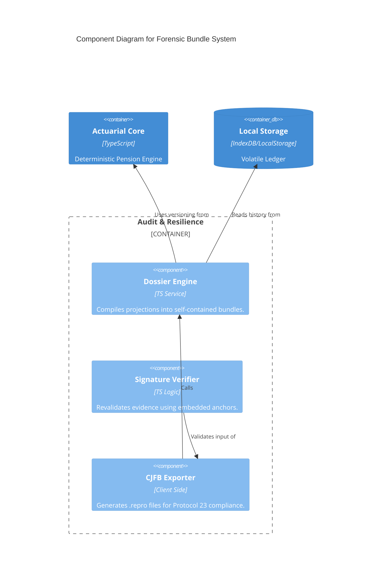

# BLUE-006: Forensic Sovereignty & Resilience Blueprint

## 🏛️ C4 Model: Data Durability Layer



## 📜 Agentic Manifest (Protocol 23)
To ensure long-term durability, the AI or Engineer implementation must:
1. **Never** include absolute paths in the bundle.
2. **Always** include the exact UMA/SMDF values used (do not reference the app's current config).
3. **Format** values with fixed precision (2 decimal places) to avoid floating point drift between different machines in the future.

## 🗃️ Folder Structure Update
```text
src/
  engine/
    audit/
      dossier-builder.ts  <-- NEW
      resilience-logic.ts <-- NEW
  components/
    DossierManager.tsx    <-- NEW
```
