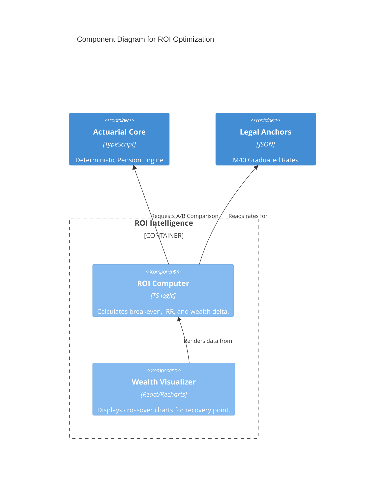

# BLUE-007: ROI Optimization Blueprint

## 🏛️ C4 Model: ROI Intelligence Layer



## 📜 ROI Manifest (Protocol 10)
To ensure adversarial robustness, the ROI implementation must:
1. **Always** show the "Recovery Month" as a primary KPI.
2. **Include** a "Cost of Waiting" metric (Loss of pension while investing).
3. **Compare** the investment against a "Safe Haven" (e.g. CETES/Fixed Income).

## 🗃️ Folder Structure Update
```text
src/
  engine/
    roi/
      ROIComputer.ts  <-- NEW
  components/
    ROIVisualizer.tsx <-- NEW
```
