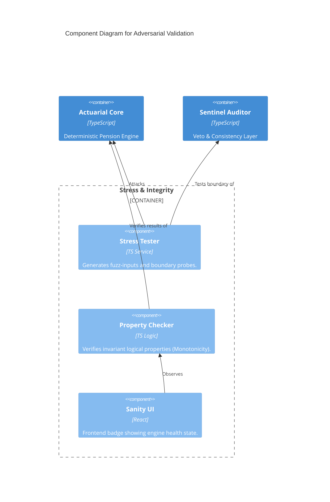

# BLUE-008: Adversarial Validation Blueprint

## 🏛️ C4 Model: Validation & Stress-Test Layer



## 📜 Adversarial Manifest (Protocol 31)
The adversarial system must maintain:
1. **Zero-Trust**: The engine must treat its own input state as potentially hostile.
2. **Deterministic Regression**: Every "Red Team" failure must be saved as a permanent test case.
3. **Graceful Failure**: If an edge case is detected, the UI must fallback to "Manual Verification Required" instead of showing a potentially wrong number.

## 🗃️ Folder Structure Update
```text
src/
  engine/
    validation/
      StressTester.ts     <-- NEW
      PropertyMatrix.ts   <-- NEW
```
