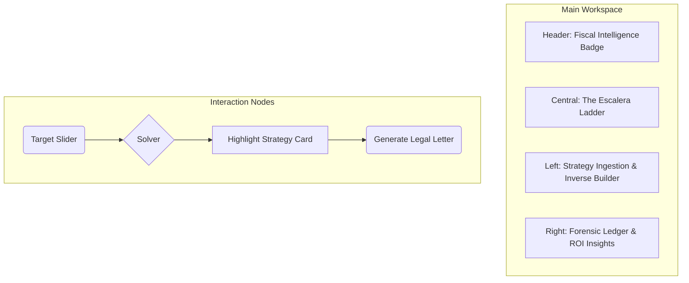

# BLUE-009: Prototype Parity & Fiscal Intelligence Blueprint

## 🏛️ C4 Model: Advanced Strategy Layer

```mermaid
C4Component
    title Component Diagram for Advanced Logic Parity

    Container_Boundary(strat_logic, "Strategy Engine") {
        Component(inverse_solver, "Inverse Solver", "TS Logic", "Newton-Raphson implementation for pension targets.")
        Component(tax_engine, "ISR Tax Engine", "TS Logic", "Calculates net pension after 15 UMA exemption.")
        Component(doc_service, "Legal Doc Service", "Template Engine", "Generates Alta M40/Baja Patronal PDFs.")
    }

    Container(logic, "Actuarial Core", "TypeScript", "Deterministic Pension Engine")
    Container(anchors, "Legal Anchors", "JSON", "UMA/INPC/SMDF Values")

    Rel(inverse_solver, logic, "Iteratively calls")
    Rel(tax_engine, anchors, "Reference UMA for exemption")
    Rel(doc_service, strat_logic, "Binds data from results")
```

## 🏗️ The Multi-Tool Suite (Protocol 34 Parity)

The system must implement the following standalone functional nodes from the legacy prototype:
1. **ISR Calculator**: Component that isolates tax liability.
2. **Retro-Sim**: Calculates the "Recargo" for backdated Modalidad 40.
3. **Escalera-View**: A horizontal progression chart $(Age \to Weeks \to Pension)$.
4. **Legal-Calendar**: Highlighting the "17th of each month" payment boundary.

## 🧭 Interaction Flow: Guided Onboarding


## 🎨 UI/UX Layout Map: "Narciso Master Suite"



## 📜 Inverse Strategy Pattern
1. **Goal**: User inputs $P_{target}$.
2. **Optimizer**: Iteratively adjust $S$ (Salary) and $T$ (Time) where $S \leq 25 \cdot UMA$ and $T \in [1, 5]$.
3. **Verification**: Call `pension-engine.ts` with suggested inputs to verify $P_{result} \approx P_{target}$.

## 🗃️ Folder Structure Update
```text
src/
  engine/
    calculator/
      InverseBuilder.ts
    fiscal/
      TaxEngine.ts
  services/
    LegalTemplateServer.ts
```
