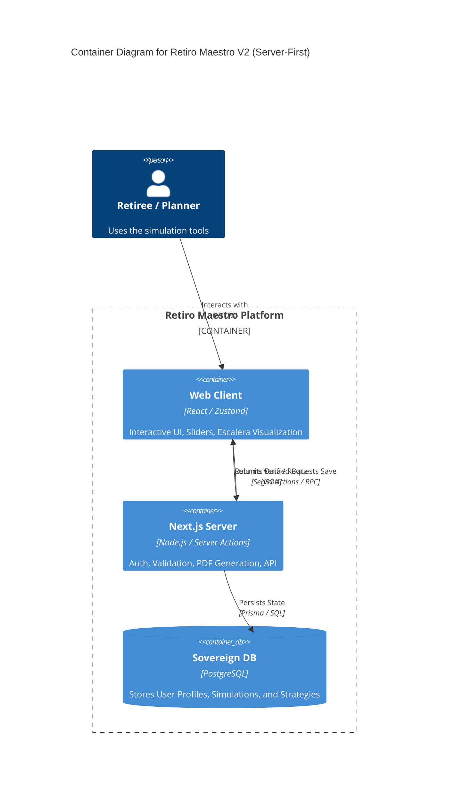

# BLUE-010: Server-Side System Blueprint

## C4 Model: Container View

## Component Architecture

### 1. `src/app` (Next.js Router)
*   `layout.tsx`: Root layout, providers (Auth, Theme).
*   `page.tsx`: Landing / Marketing.
*   `dashboard/page.tsx`: Protected simulation view (Server Component).

### 2. `lib` (Shared Core)
*   `engine/`: The core `PensionEngine` logic (Shared).
*   `db/`: Prisma client instantiations.
*   `utils/`: Formatting and helpers.

### 3. `actions` (Server Entry Poins)
*   `calculate.ts`: Server-side run of the engine.
*   `saveSimulation.ts`: Writes to DB.
*   `generateLegalDoc.ts`: Server-side PDF generation.

## Data Flow
1.  **Input**: User adjusts slider in `web_client`.
2.  **Feedback**: `web_client` updates UI instantly (Client Engine).
3.  **Commit**: User clicks "Save Strategy".
4.  **Transport**: Data sent via Server Action to `next_server`.
5.  **Verify**: `next_server` re-runs calculation to verify integrity.
6.  **Persist**: `next_server` writes to `database`.
7.  **Confirm**: UI receives "Saved" confirmation with a durable ID.
