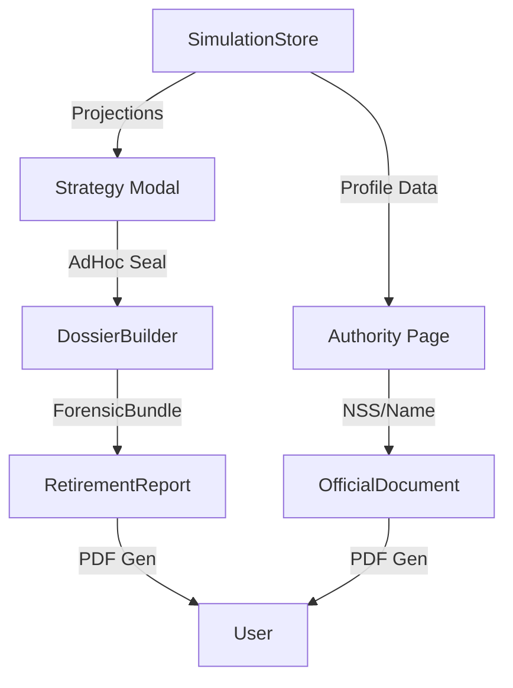

# BLUE-020: Forensic Report Architecture

## 1. Overview
The Forensic Report system translates digital actuarial simulations into legally durable evidence. This is achieved through two primary PDF components: the **Retirement Report** (Sovereign Audit) and the **Official Document** (Legal Filing).

## 2. Component Design

### 2.1 Retirement Report (`RetirementReport.tsx`)
A multi-page PDF document summarizing the simulation logic.
- **Forensic Footer**: Embedded `Integrity Seal` (SHA-256 Hash) of the data bundle.
- **Semantic Detail**: Includes year-by-year amortization and salary averages.
- **Integrity Data**: Accepts a `ForensicBundle` prop to verify calculation versioning.

### 2.2 Official Document (`OfficialDocument.tsx`)
Low-aesthetic, high-compliance legal templates for IMSS filings.
- **M40 (Alta)**: Written request for Modalidad 40 (Art. 218 LSS).
- **Renuncia**: Voluntary resignation letter for pension timing.
- **Dynamic Identity**: Pre-populated with name and NSS from the `SimulationStore`.

## 3. Data Flow

## 4. Forensic Binding
The reports are bound to human-readable manifests:
1. **The Hash**: Unique fingerprint of (Anchors + Projections + Formulas).
2. **The Manifest**: Embedded explanation of "PCB" and "APCB" definitions within the `ForensicBundle`.

## 5. Metadata
- **Status**: IMPLEMENTED
- **Strategy**: STRAT-019
- **Domain**: Legal-Actuarial
