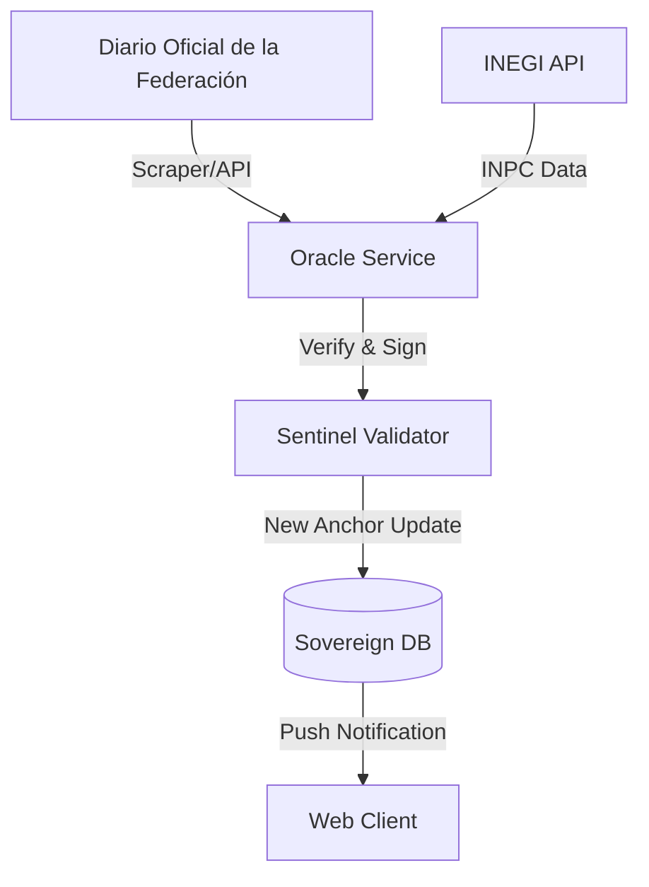

# BLUE-021: The Sovereign Economic Oracle

## 1. Overview
Automated service to synchronize the `legal-anchors.json` with official governmental data (UMA, INPC, SMDF).

## 2. Architecture

## 3. Data Integrity (Protocol 31)
1.  **Adversarial Veto**: The Oracle cannot update values by more than 15% in a single jump without a manual "Super-user" override.
2.  **Versioning**: Every anchor update creates a new row in the `AnchorHistory` table with a unique `anchor_hash`.
3.  **Audit Trail**: Logs must include the source URL and timestamp of the government publication.

## 4. Implementation (Server Action)
-   `actions/syncAnchors.ts`: Triggered by a CRON job or manually by an admin.
-   Uses `cheerio` for DOF scraping and `fetch` for INEGI endpoints.

## 5. Metadata
- **Status**: PROPOSED
- **Strategy**: STRAT-020
- **Domain**: Infrastructure
