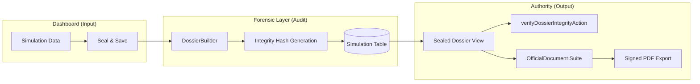

# BLUE-024: The Authority Dossier & Forensic Audit Trail

## 1. Architectural Objective
To provide a verifiable, immutable record of all forensic projections and legal document generation, ensuring that every "Authority-Certified" FOJA can be validated against the system's core laws.

## 2. Component Diagram

## 3. The Forensic Manifest
Every sealed dossier contains a manifest of the mathematical and legal rules used:
- **PCB**: Porcentaje de Cuantía Básica (Art. 167 LSS).
- **APCB**: Asignaciones por Cuantía Básica (Incrementos).
- **UMA Source**: Snapshot of the `EconomicAnchor` used at T-0.

## 4. Audit Protocol (P34)
- **Point-in-Time Verification**: High-stakes reports are not re-calculated with new UMAs by default. They are "Frozen" to match the IMSS certificate generated on that specific date.
- **Vulnerability Guard**: Any mismatch between the saved `integrity_hash` and the current reconstructive hash triggers a "Security Veto," marking the document as **MANIPULATED**.
