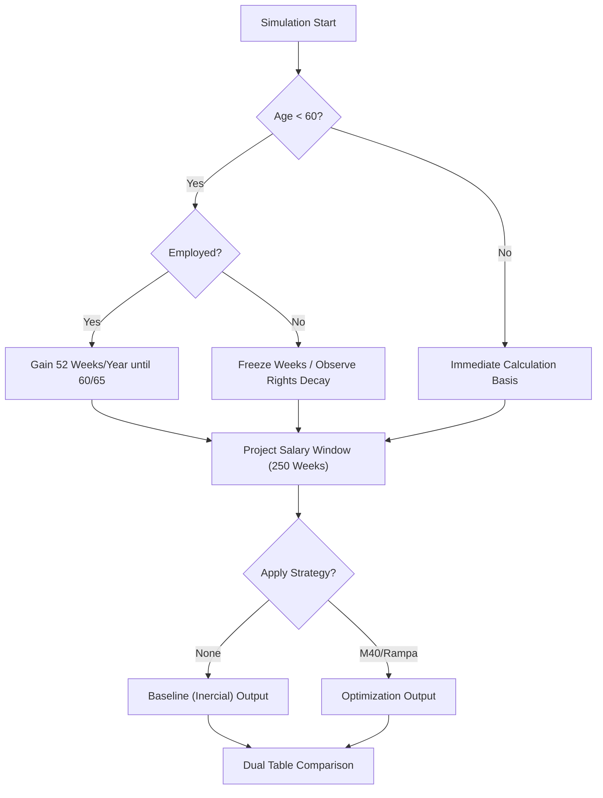

# BLUE-025: Logic Flow for Universal Pension Projections

## 1. System Architecture
This blueprint maps the branching logic for the "Universal" simulation engine, ensuring that users under 60 and those with varying employment statuses receive accurate projections.

## 2. Logic Flow Diagram

## 3. Component Interaction
- **Dashboard Input**: Provides `age`, `weeks`, `salary_prom`, and `employment_status`.
- **Pension Engine**: Executes the recursive loop defined in `calculateProjection`.
- **PDF Generator**: Consumes dual data arrays to render the "Universal" comparison.
