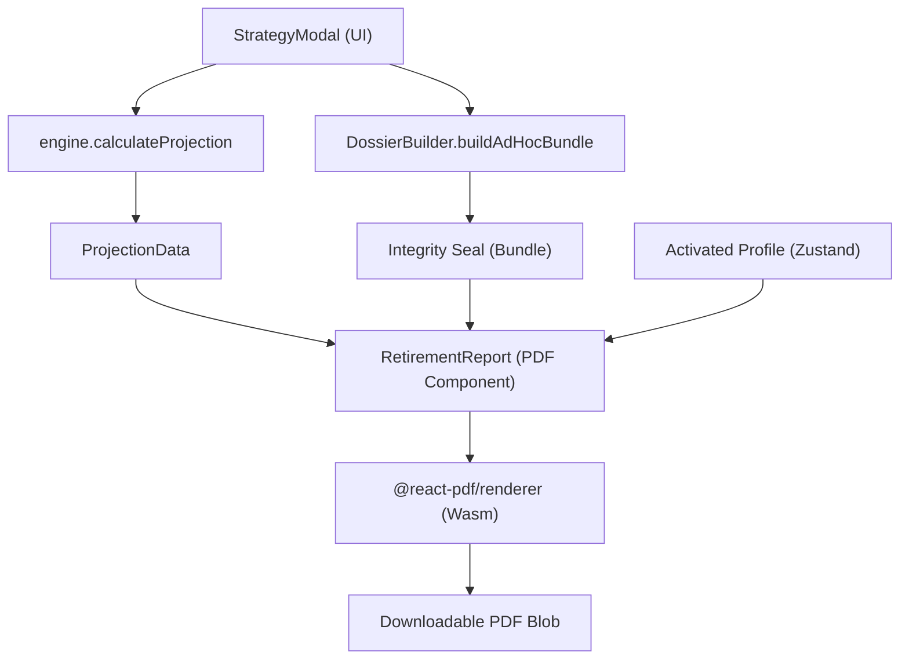

# BLUE-028: Mapping del Motor de Reportes Finales

## 1. Arquitectura del Flujo de Datos
El motor de reportes finales integra datos de múltiples subsistemas para generar un dossier consolidado. El flujo se activa en el cliente (Browser) para preservar la soberanía de los datos.

## 2. Mapa de Secciones del Reporte
Cada sección del reporte PDF (`RetirementReport.tsx`) mapea a un bloque lógico derivado del análisis de los baselines `.docx`.

| Sección PDF | Origen de Datos | Propósito |
| :--- | :--- | :--- |
| **Perfil del Cliente** | `PensionInput` | Validación de identidad y estatus actual. |
| **Comparativa Estratégica** | `strategyResult` vs `baselineResult` | Justificación matemática del ROI y beneficio. |
| **Tablas de Amortización** | `projectionData` | Desglose año por año de la inversión y pensión. |
| **Recuperables y Desglose** | `input.aforeSaldos` | Cálculo de montos retornables (Retiro 97, Infonavit). |
| **Honorarios** | `StrategyModal` logic | Transparencia comercial sobre el costo del servicio. |
| **Sello de Integridad** | `bundle.integrity_hash` | Garantía de inmutabilidad forense del cálculo. |

## 3. Integración con el Sistema de Identidad
Si el `certifiedDossier` del parser heurístico está presente, el reporte inyecta automáticamente el bloque de "Extracción Verificada", vinculando el documento físico origen (PDF de semanas) con la proyección digital, cerrando el círculo de confianza.

## 4. Estándares Visuales (Narciso PDF)
- **Colores**: Indigo-600 (`#4f46e5`) para títulos, Emerald-600 (`#059669`) parea éxitos/ROI, Magenta/Fushia (`#c026d3`) para honorarios/recuperables.
- **Fuentes**: Helvetica/Helvetica-Bold (Nativo PDF) para máxima legibilidad sin dependencias de red externas.
- **Layout**: Diseño de grilla flexible para asegurar que el reporte sea legible tanto en impresión física como en dispositivos móviles.
