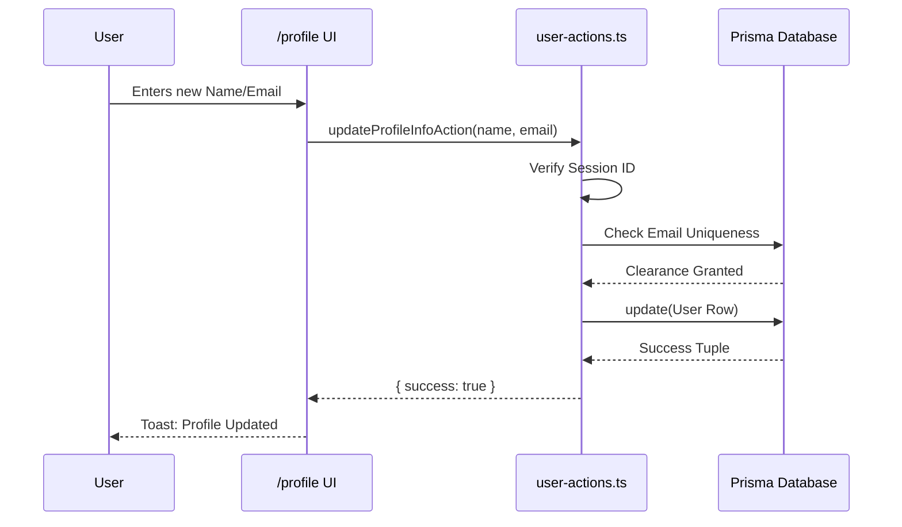

# User Profile UI & Data Actions (BLUE-031)

## Architecture Outline
The Sovereign Profile Management feature introduces a new route and two specialized Server Actions. This blueprint defines the flow of information from the user interface down to the raw database mutations.

## Core Components

### 1. The Client UI (`app/(main)/profile/page.tsx`)
- **Type:** React Client Component (`'use client'`)
- **Function:** Serves as the interactive dashboard for identity management.
- **State Management:** Uses React `useState` to track input fields (Name, Email, Current Password, New Password) and loading mechanisms independently for the two separate update panels.
- **Feedback:** Incorporates the global `useToast()` hook to deliver immediate visual feedback (Success/Error) based on the Server Action response.

### 2. The Server Actions (`src/actions/user-actions.ts`)
- **Type:** Next.js Server Actions (`'use server'`)
- **Dependencies:** `@/auth` (Session Parsing), `@/lib/db` (Prisma Engine), `bcryptjs` (Hashing).
- **Functions:**
  - `updateProfileInfoAction(name, email)`: Retrieves the `session.user.id`, validates the payload, checks for email collision, and executes `prisma.user.update`.
  - `updatePasswordAction(currentPassword, newPassword)`: Retrieves the `session.user.id`, queries the existing password hash, runs `bcrypt.compare`, and if valid, hashes the `newPassword` and executes `prisma.user.update`.

## Data Flow Diagram

