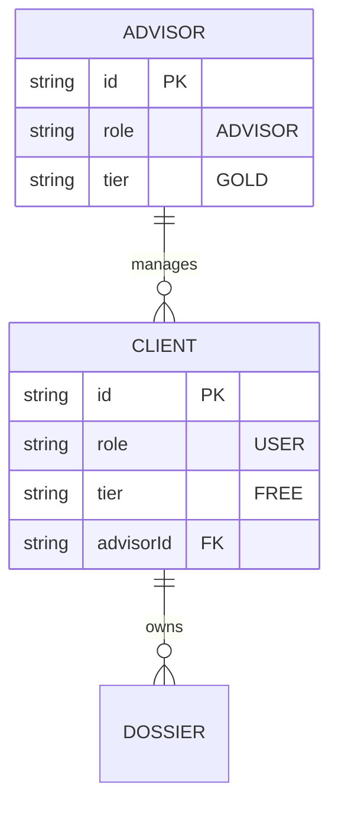

# Advisor CRM & Client Mapping (BLUE-032)

## Architecture Outline
To support the B2B2C strategy (STRAT-032), the system must map standard users to their respective advisors. This requires a dedicated CRM view for advisors and a relational link in the database.

## Core Components

### 1. Database Relational Model (Prisma)
The `User` model acts as both the client and the advisor, differentiated by the `role` enum.
*   **Client Field:** A standard `User` will receive an optional `advisorId` field, which acts as a foreign key pointing to another `User` record where `role === 'ADVISOR'`.
*   **Advisor Field:** An `ADVISOR` user will have a virtual relation `clients` returning an array of customized `User` records.

### 2. The Advisor Dashboard (`app/(main)/portfolio/page.tsx`)
A new top-level route serving as the CRM for the advisor.
*   **Client List:** A data table displaying all assigned clients, their tier status, and a quick link to their Sovereign Dossier.
*   **Impersonation/Delegation:** The advisor can click into a client's profile and run simulations *as the client*, saving strategies directly to the client's dossier.

### 3. Tier Check & Feature Gating
*   **Free Tier Restriction:** Free Users (`tier === 'FREE'`) can run basic simulations. The UI must enforce the "1 simulation per week" limit and lock the "Detailed Report" downloads.
*   **Gold Tier Unlocks:** Advisors (`tier === 'GOLD'`) operating on client dossiers can bypass the weekly limits, unlock the full strategic N-dimensional calendar, and generate comprehensive PDF/Docx reports.

## Data Flow Diagram

