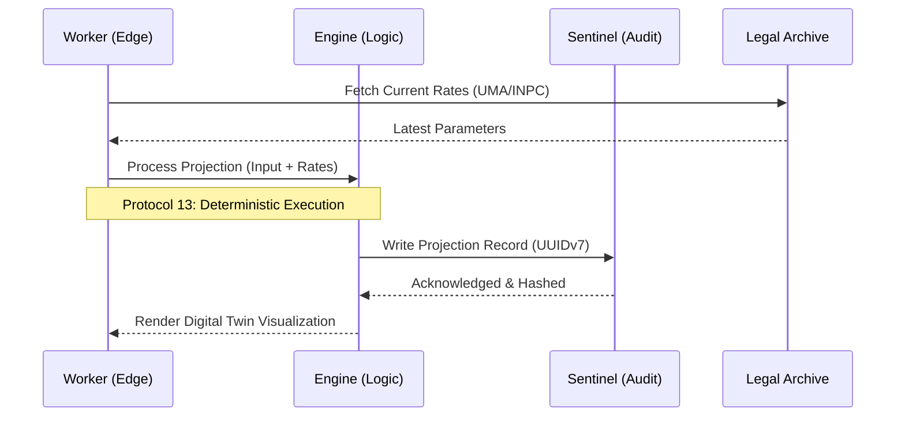

# 🌀 N2 Interface & Causal Flow: Pension Engine

Mapping the movement of data between the worker, the engine, and the immutable audit bedrock.

## N2 Interface Matrix

| From \ To | Worker UI | Actuarial Engine | Audit Store | Legal Data |
| :--- | :--- | :--- | :--- | :--- |
| **Worker UI** | - | User Input (Weeks, $) | Signed Projections | Scenario Requests |
| **Actuarial Engine** | Calculation Result | - | Deterministic Log | Coefficient Queries |
| **Audit Store** | Verification Proof | Historical Trend | - | Hash Integrity |
| **Legal Data** | Latest Rates | Coefficients | - | - |

## Causal Flow (Mermaid)
