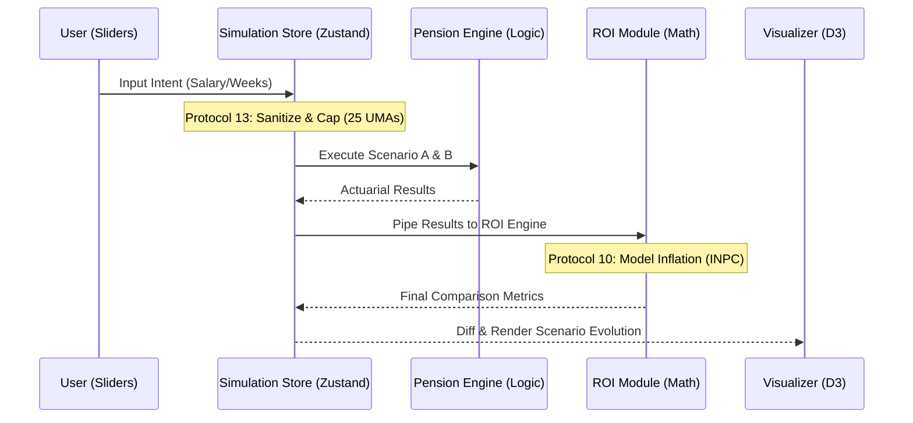

# 🌀 N2 Interface & Causal Flow: Digital Twin Simulation

Mapping the reactivity and state synchronization required for real-time scenario modeling.

## N2 Interface Matrix

| From \ To | UI Sliders | Simulation Store | Pension Engine | ROI Calculator |
| :--- | :--- | :--- | :--- | :--- |
| **UI Sliders** | - | Raw Inputs (Debounced) | - | - |
| **Simulation Store** | Validated State | - | Scenario Params (A/B) | Aggregated Metrics |
| **Pension Engine** | - | Result Stream | - | Actuarial Deltas |
| **ROI Calculator** | Charts/Tables | ROI Metrics | Breakeven Data | - |

## Causal Flow (Mermaid)

