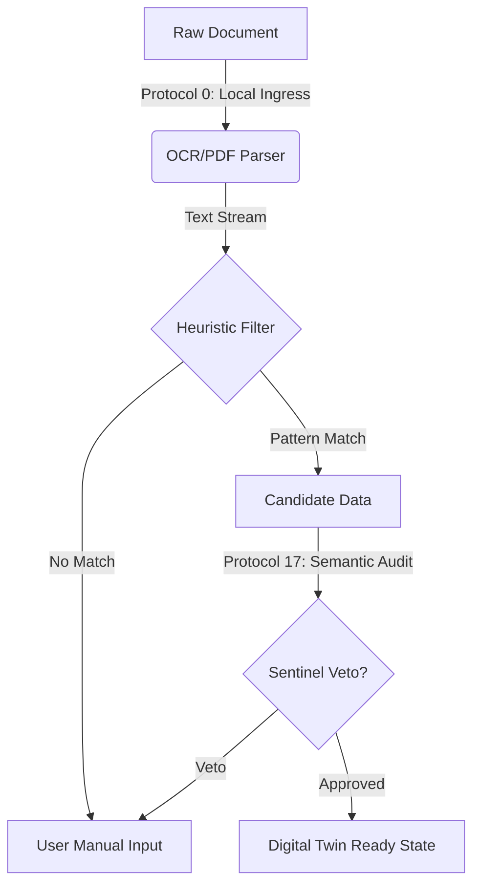

# 🌀 N2 Interface: Document Ingestion Flow

Mapping the transition from raw unstructured files to verified actuarial state.

## Causal Flow (Mermaid)

```mermaid
graph TD
    A[Raw Document] -->|Protocol 0: Local Ingress| B(OCR/PDF Parser)
    B -->|Text Stream| C{Heuristic Filter}
    C -->|Pattern Match| D[Candidate Data]
    C -->|No Match| E[User Manual Input]
    D -->|Protocol 17: Semantic Audit| F{Sentinel Veto?}
    F -->|Veto| E
    F -->|Approved| G[Digital Twin Ready State]
```
