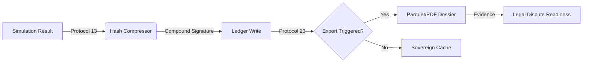

# 🌀 N2 Interface: Evidence Signing Causal Flow

Mapping the transition from a volatile simulation result to a permanent legal record.

## Causal Flow (Mermaid)

## Inteface Matrix
| Component | Input | Payload | Output |
| :--- | :--- | :--- | :--- |
| **Hasher** | `PensionResult` | Actuarial State | `Hash16` |
| **Ledger** | `Hash16` | Timestamped Record | `Persistence_ACK` |
