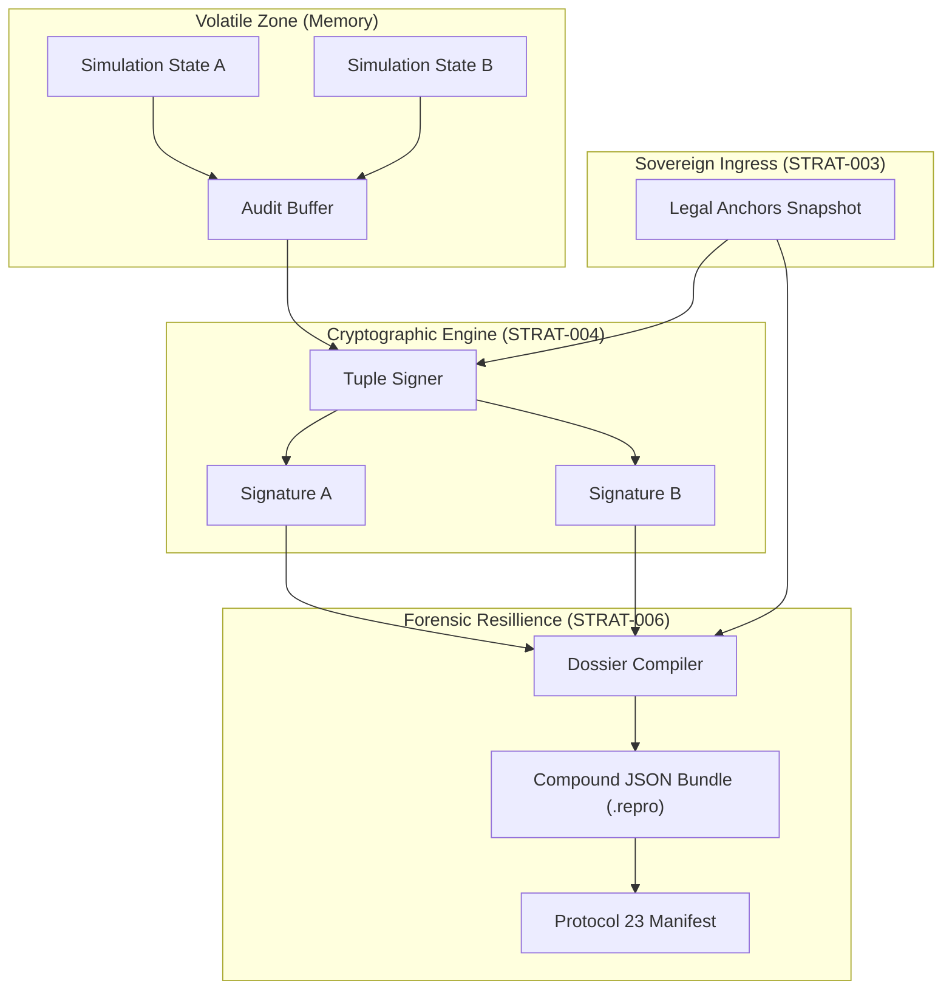

# N2-006: Forensic Bundle Causal Flow

Mapping the transition from volatile simulation state to immutable legal archive.

## Internal Dependencies
1. **Dossier Compiler** depends on the `useLedgerStore` (Store) and the current `Legal Anchors` (Bedrock).
2. **Signature Integrity** is confirmed by running the `EvidenceSigner` against the `anchors_snapshot` provided *inside* the bundle.
