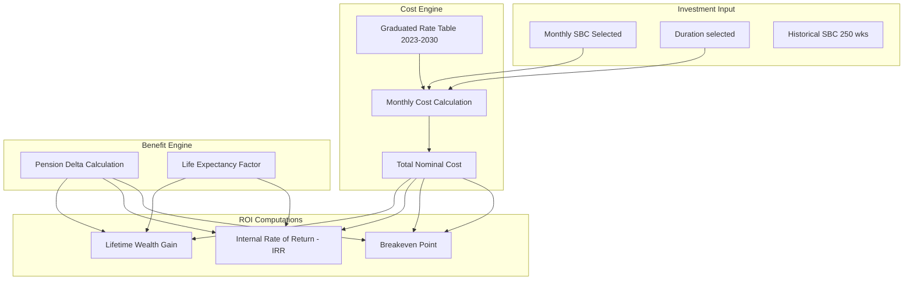

# N2-007: ROI Optimization Causal Flow

Mapping the calculation loop for investment recovery and yield.

## Internal Dependencies
1. **Cost Engine** depends on `legal-anchors.json` for the graduated M40 rates.
2. **Benefit Engine** depends on `PensionEngine.ts` output.
3. **Life Expectancy** is tied to user `age` input.
