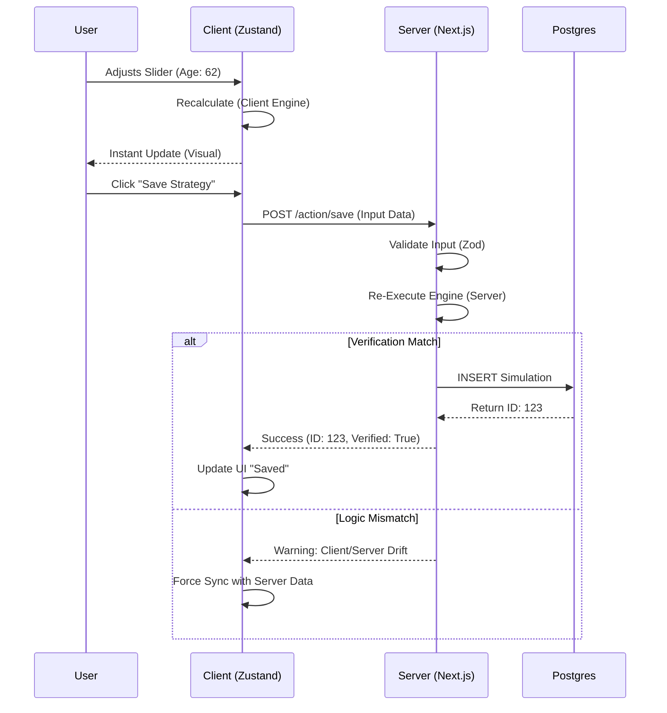

# N2-010: Causal State Map (Server Sync)

## 1. The "Dual-State" Problem
In a hybrid architecture, we have two sources of "Current Truth":
1.  **Local State (Zustand)**: Fast, volatile, unverified.
2.  **Remote State (Postgres)**: Slow, durable, verified.

## 2. Synchronization Flow

## 3. State Nodes

### `UNSAVED_DRAFT`
*   **Location**: Client RAM / LocalStorage
*   **Status**: Volatile
*   **Trust**: Low (User manipulation possible)

### `VERIFYING`
*   **Location**: Server RAM (In-flight)
*   **Status**: Transient
*   **Logic**: Input Sanitization + Engine Run

### `SOVEREIGN_RECORD`
*   **Location**: Postgres Row
*   **Status**: Immutable (Versioned)
*   **Trust**: High (Cryptographically Signed if using audit module)

## 4. Signal Vectors
*   **Vector A (Input)**: User Intent -> Client State
*   **Vector B (Commit)**: Client State -> Server Verification
*   **Vector C (Persist)**: Server Verification -> Database
*   **Vector D (Hydrate)**: Database -> Client State (On Load)
