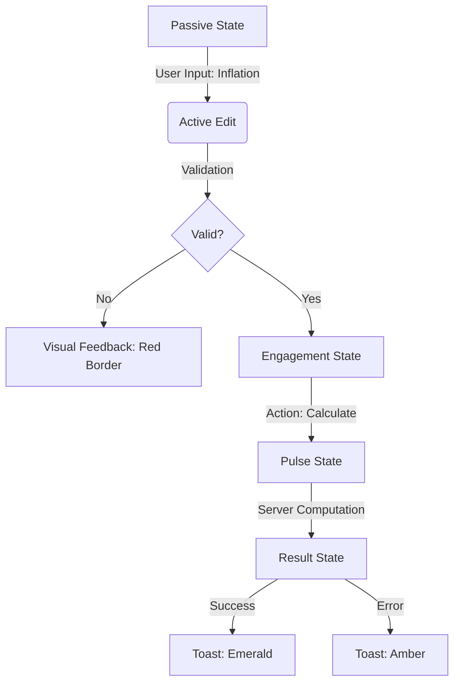

# N2-011: Sovereign Interaction Map

## User Journey: "The Pulse of Calculation"

This map defines the emotional and technical state transitions during a user's interaction with the Sovereign Dashboard.

### 1. State Flow (Mermaid)

### 2. The "Pulse" Protocol
*   **Trigger**: Any server action initiation.
*   **Visual**: All interactive elements (Charts, Result Cards) must reduce opacity to 0.7 and animate a "breathing" skeleton.
*   **Resolution**: Instant snap-back to 1.0 opacity with new data.

### 3. Mobile Adaptation
*   **View**: `Dashboard`
*   **Breakpoint**: `< 768px`
*   **Transformation**:
    *   Sidebar -> `Drawer (Hidden)`
    *   Grid -> `Flex-Col`
    *   Charts -> `Scrollable Horizontal Container`

---
## ⚖️ Sovereignty & Authority Ledger
| Metric | Value |
| :--- | :--- |
| **Document ID** | [018db58e-N2-011-UX-b1d4-f6a1f9f87dec] |
| **Parent Strategy** | [STRAT-005] |
| **Domain Sovereignty** | [Interaction-Design] |
| **Consensus State** | [MAPPED] |
