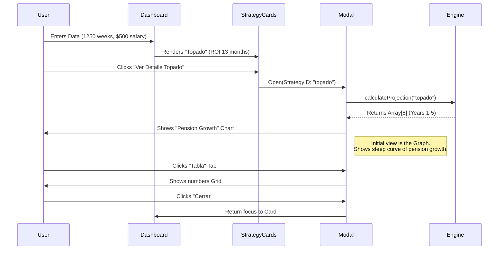

# N2-015: Deep Analysis Flow

## User Journey: "The Skeptic"
*User wants to know if paying 5 years of Modalidad 40 is actually worth it.*

## Micro-interactions
-   **Chart Hover**: When hovering year 3 on the chart, show a tooltip with "Pensión: $45,000 | Inversión: $300,000".
-   **Tab Switch**: Smooth `framer-motion` slide between Chart and Table views.
