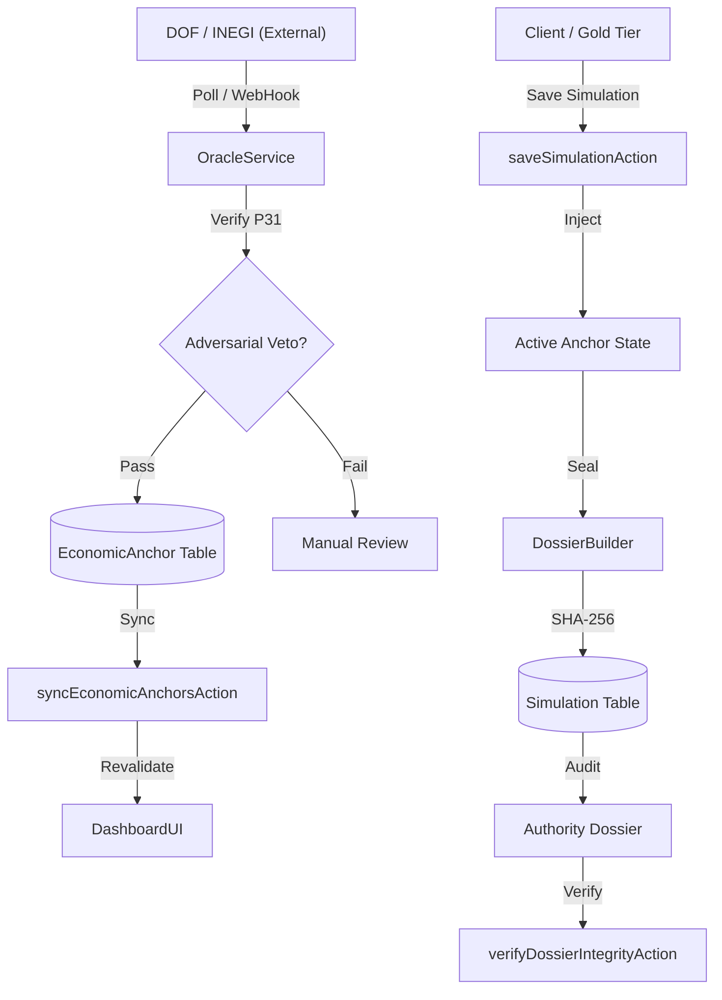

# N2-016: Sovereign Oracle & SaaS Recursive Flow

## 🎯 Causal Loop
This map defines the interaction between the automated economic data ingestion and the multi-tenant simulation engine.

## 🛠️ Interaction Nodes

### 1. The Oracle Junction (Forensic Ingestion)
- **Causality**: External legal changes (UMA updates) trigger an immediate re-certification opportunity for all active simulations.
- **Resilience**: The `EconomicAnchor` table acts as a historical versioning system, allowing "Legacy" simulations to be compared against "Current" economic reality.

### 2. The Multi-Tenant Sandbox (SaaS Isolation)
- **Causality**: `user.tier` dictates the availability of high-stakes nodes (Forensic Dossiers, PDF Certifications).
- **Security**: Persistence is handled via `upsert` nodes tied to `userId`, preventing cross-tenant data leakage during the high-throughput sync.

### 3. The Forensic Handshake (Finality)
- **Causality**: Saving a simulation creates a recursive link between the `PensionEngine` output and the `DossierBuilder`.
- **Manifest**: The hash is not just a checksum; it's a binding of (User Intent + Legal Anchors + Engine Version).
