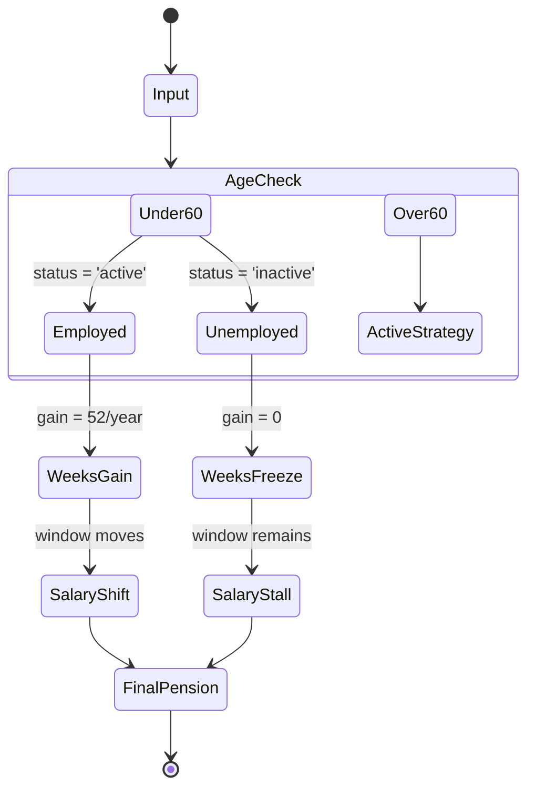

# N2-017: State Machine for Employed vs Unemployed Simulations

## 1. Overview
This map defines the state transitions of the pension engine when handling the `is_ongoing_work` variable across different age groups.

## 2. Interaction Nodes
| Node ID | Component | Role | Dependencies |
| :--- | :--- | :--- | :--- |
| **N.UI.STATUS** | Dashboard Toggle | Sets `employment_status` | User Input |
| **N.ENG.WEEKS** | Pension Engine | Calculates weekly gain/freeze | N.UI.STATUS |
| **N.ENG.AVGW** | Library Logic | Shifts the 250-week window | N.ENG.WEEKS |
| **N.REP.COMP** | PDF Generator | Renders AS-IS (Projected) vs TO-BE | N.ENG.AVGW |

## 3. State Diagram

