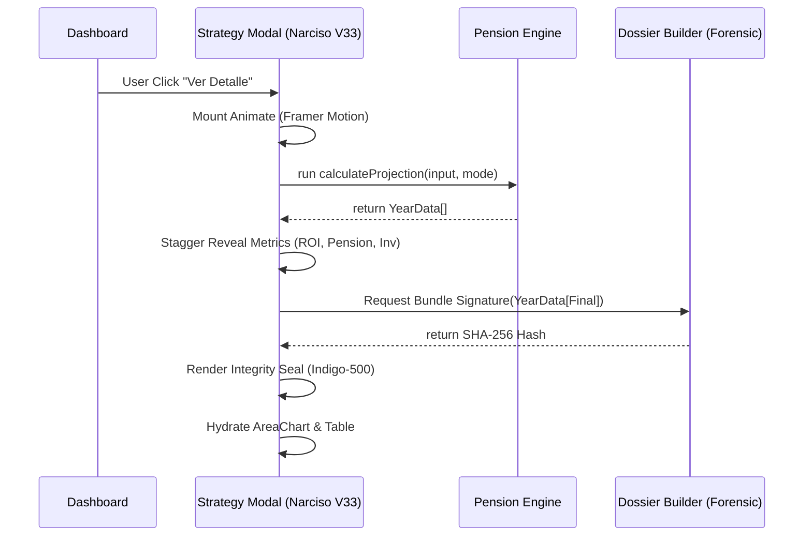

# N2-018: Strategy Modal Interaction Loop

## Mapping the transition from Dashboard summary to Deep Forensic Analysis.

## N2 Interface Matrix

| From \ To | Dashboard View | Strategy Modal | Pension Engine | Dossier Builder |
| :--- | :--- | :--- | :--- | :--- |
| **Dashboard View** | - | `onOpen(strategy)` | Passthrough Params | - |
| **Strategy Modal** | `onClose()` | - | `calculateProjection` | `buildAdHocBundle` |
| **Pension Engine** | - | Result Array[N] | - | Actuarial State |
| **Dossier Builder** | - | `integrity_hash` | - | - |

## Causal Flow (Mermaid)

## Internal Dependencies
1. **Kinetic Sequence**: The rendering of the `Integrity Seal` must coincide with the final stagger step of the UI to reinforce valid acquisition.
2. **State Consistency**: If `input` changes while Modal is open (via external store mutators), the Modal must trigger a "Pulse" re-calculation.

---
**Status**: MAPPED
**ID**: N2-018
