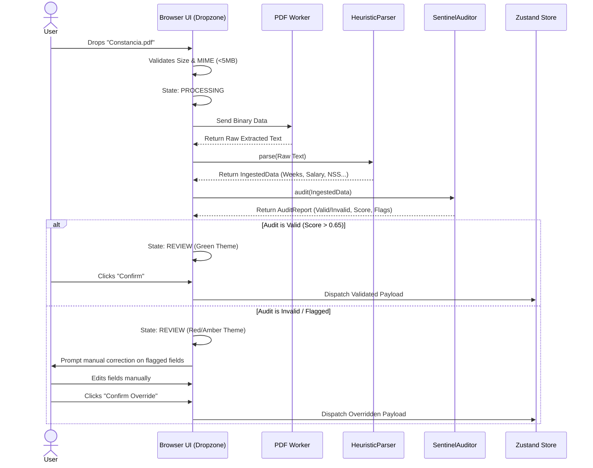

# N2-019: Ingestion Verification Interaction Flow

## 1. Interaction Diagram

This sequence details the interaction between the User UI, the Local Extractors, and the State Engine during document ingestion.

## 2. Kinetic Feedback Loops
- **Processing Phase**: Fast, pulsing gradient animation to indicate local computation.
- **Review Phase (Valid)**: Staggered reveal of pre-filled inputs with green checkmarks.
- **Review Phase (Flagged)**: Targeted red borders on specific inputs (e.g., DOB) with an inline rendering of the Sentinel recommendation text.
