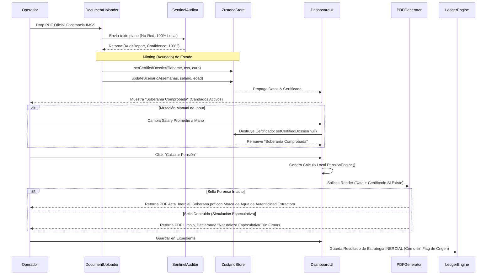

# N2-020: Flujo de Ingestión Forense y Certificación Criptológica

Este diagrama ilustra el flujo Criptológico de Procedencia de Datos, desde que el Archivo Físico toca el Cliente, hasta que se emite su huella en el Acta Final y se registra en el Ledger Subyacente, obedeciendo a la arquitectura STRAT-025.

