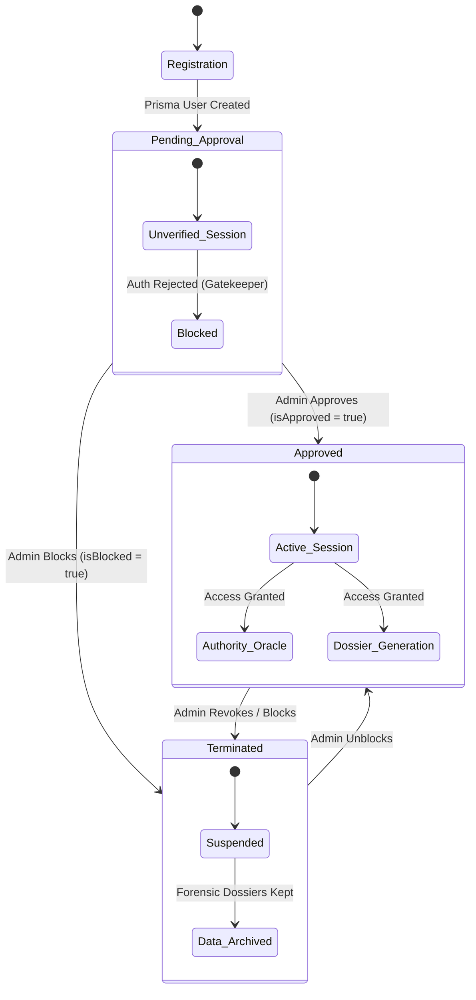

# N2-022: Identity Lifecycle & Authorization State Machine

The following N2-Map describes the identity state lifecycle of a user within the Retiro Maestro ecosystem, governed by the Admin Control Panel.

## State Definitions

1. **Pending Approval (`isApproved = false, isBlocked = false`)**: The user has successfully created an account in the database but cannot generate a session token. Attempting to log in yields an "Account Pending" error.
2. **Approved (`isApproved = true, isBlocked = false`)**: The golden path. The user has full operational clearance according to their respective `Tier`.
3. **Terminated / Blocked (`isBlocked = true`)**: An override state. Regardless of `isApproved`, a blocked user is immediately disconnected from the application matrix. Their historical dossier inputs and forensic hashes remain intact in the database for auditing purposes, but perimeter access is zero trust.
