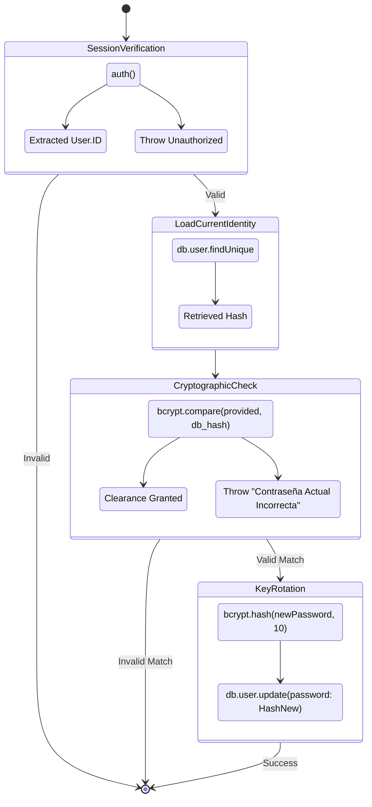

# Sovereign Key Rotation State Machine (N2-023)

## Flow Overview
This diagram maps the logical execution flow of the `updatePasswordAction`. It enforces a strict authorization gate before allowing a user to rotate their cryptographic key.

