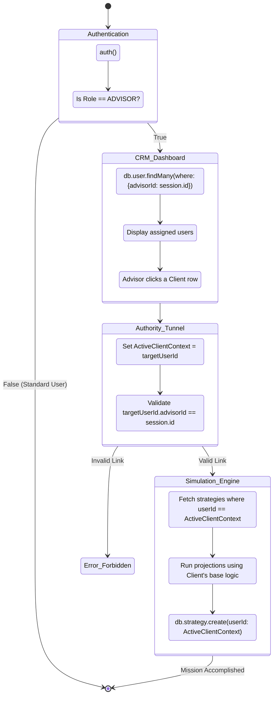

# Advisor Identity Impersonation Matrix (N2-024)

## Flow Overview
This state diagram models the logic required for an Advisor to view and mutate a Client's data without exposing other clients. It maps the architectural necessity of a "Delegated Session" context.

