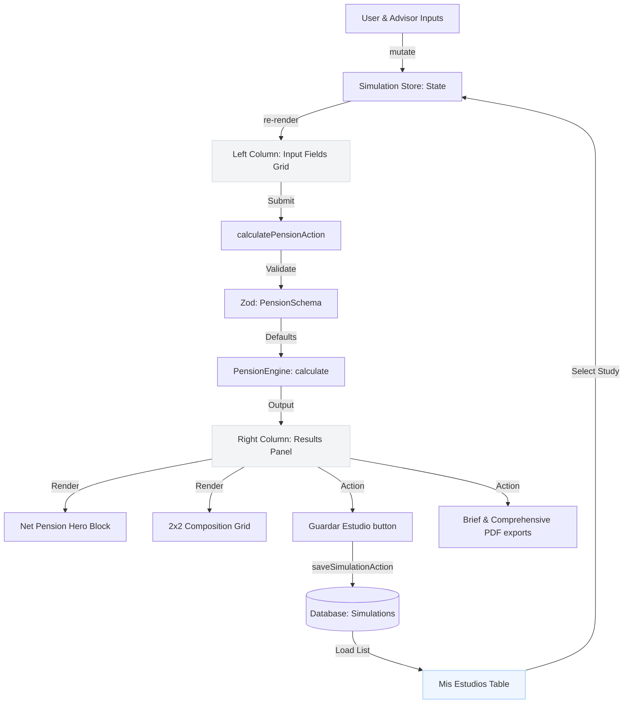

# Compact High-Density Dashboard Data Flow Map (N2-025)

## Flow Overview
This diagram models the responsive data flow, UI layout nodes, and state updates that occur when inputs are manipulated, simulations are loaded, or payments are toggled.

## Layout Grid Node Specifications
1. **Left Column (`lg:col-span-5`)**:
   - `GridRow 1`: Age & Retirement Age inputs (`h-[38px]`).
   - `GridRow 2`: Weeks & Average Salary inputs (`h-[38px]`).
   - `GridRow 3`: Date of Baja (`h-[38px]`) & Estatus Laboral Checkbox card (`h-[38px] px-3`).
   - `Details`: Collapsible accordions for Opciones Avanzadas and Asignaciones Familiares.
2. **Right Column (`lg:col-span-7`)**:
   - `Hero Card`: Display net estimated pension monthly amount.
   - `Breakdown`: Compact 2x2 grid metrics cards.
   - `Actions`: Symmetric `grid-cols-3` row for Save, Brief PDF, and Comprehensive PDF.
   - `History Table`: Fixed container with `max-h-[160px] overflow-y-auto` and `sticky top-0` table header.
